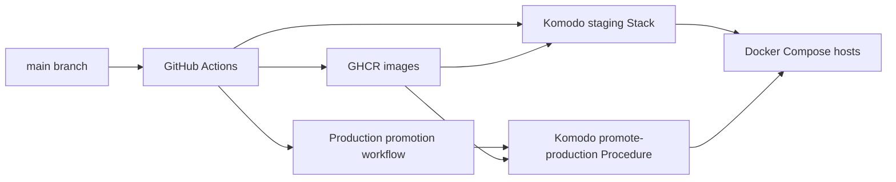

<p align="center">
  <a href="https://logid.xyz">Reputo</a> is a privacy-preserving reputation platform with three main surfaces: a NestJS API, a Next.js UI, and Temporal-based workers that orchestrate snapshot execution and algorithm runs.
  <br/>
  This repository is the pnpm monorepo for those apps and the shared packages they build on.
</p>

<div align="center">

[](https://github.com/reputo-org/reputo/actions/workflows/main.yml)&nbsp;[](https://codecov.io/gh/reputo-org/reputo)&nbsp;[](LICENSE)

</div>


## App & API References

| Surface | URL |
| --- | --- |
| App | [staging.logid.xyz](https://staging.logid.xyz) 
| API Reference | [api-staging.logid.xyz/reference](https://api-staging.logid.xyz/reference) 

## Getting Started

Toolchain versions are pinned in [mise.toml](mise.toml) (Node `24.14.0`, `pnpm@10.30.3`). The fastest way to get a working environment is [mise](https://mise.jdx.dev):

```bash
brew install mise   # or see mise.jdx.dev for other platforms
mise run setup      # installs Node + pnpm, copies .env.example -> .env, runs pnpm install
```

Without mise, install Node `24.14.0` and `pnpm@10.30.3` yourself, then:

```bash
cp .env.example .env
# then fill in placeholders (secrets are empty by default)
pnpm install
```

`.env` at the repo root is the single source of env vars for local
development; `scripts/env/load.ts` loads it before any dev process spawns. See
[.env.example](.env.example) for the var inventory.

All `pnpm` scripts have a `mise run` equivalent (see `mise tasks`).

### Local

```bash
pnpm dev
```

Builds the workspace packages, then runs `@reputo/api`, `@reputo/ui`, and
`@reputo/workflows` concurrently in watch mode. Each app sees the env vars from
`.env`.

### Docker

```bash
pnpm docker:dev
```

Hot-reload local testing stack: UI at `http://localhost`, API at
`http://localhost/api`, Temporal UI at `http://localhost:8088`, Grafana at
`http://localhost:3001`. Same `.env` source — `pnpm docker:dev` injects it
into `docker compose` for `${VAR}` interpolation.

See [docker/README.md](docker/README.md).

### Checks

```bash
pnpm build
pnpm check
pnpm test
```

## Monorepo Overview

### Apps

| Workspace | Purpose | Docs |
| --- | --- | --- |
| `@reputo/api` | NestJS HTTP API. Owns the application PostgreSQL database (TypeORM) and hosts a Temporal worker that exposes snapshot activities to the Workflows worker. | [README](apps/api/README.md) |
| `@reputo/ui` | Next.js dashboard for browsing algorithms, creating presets, launching snapshots, and tracking execution. | [README](apps/ui/README.md) |
| `@reputo/workflows` | Temporal workers for orchestration, TypeScript algorithm execution, and on-chain data tasks. Persistence is proxied to the API via Temporal activities; the worker holds no DB connection of its own. | [README](apps/workflows/README.md) |

### Packages

| Workspace | Purpose | Docs |
| --- | --- | --- |
| `@reputo/reputation-algorithms` | Versioned algorithm registry and discovery library. | [README](packages/reputation-algorithms/README.md) |
| `@reputo/algorithm-validator` | Shared Zod validation for algorithm payloads and CSV content. | [README](packages/algorithm-validator/README.md) |
| `@reputo/contracts` | Cross-service DTOs, enums, and Temporal activity I/O shared between the API and Workflows. | [README](packages/contracts/README.md) |
| `@reputo/storage` | Shared S3 storage abstraction and presigned URL helpers. | [README](packages/storage/README.md) |
| `@reputo/onchain-data` | Token transfer sync pipeline backed by PostgreSQL (TypeORM). | [README](packages/onchain-data/README.md) |
| `@reputo/deepfunding-portal-api` | DeepFunding Portal API client and SQLite (TypeORM) ingest utilities. | [README](packages/deepfunding-portal-api/README.md) |

## Environments

- Preview deployments are created for pull requests that carry the `pullpreview` label. They publish only `preview-<commit>` image tags.
- Main branch builds publish immutable `sha-<commit>` images for affected apps and update the mutable `staging` tag for those same apps.
- Komodo is the staging and production deploy mechanism. Main branch CI calls the `reputo-apps-staging` Stack webhook after publishing affected images.
- Production promotion is manual and digest-based: GitHub Actions resolves the digest behind `sha-<commit>`, updates only the affected apps to the `production` channel tag, and calls the Komodo `promote-production` Procedure.



### Environment Files

- Local dev: the tracked root [.env.example](.env.example) is the sole
  template. Copy to `.env` and fill in. `scripts/env/load.ts` loads it for
  both `pnpm dev` and `pnpm docker:dev`.
- Staging/production: Komodo Variables (defined in
  [komodo/resources/variables.toml](komodo/resources/variables.toml)) are the
  sole source. The deploy compose file
  ([docker/compose/compose.yml](docker/compose/compose.yml)) carries no
  `env_file:` directives — every value flows through `${VAR}` interpolation
  from the Komodo-generated `.env`. Service selection per stack is by
  `COMPOSE_PROFILES` (`apps`, `infra,observability`).

For operational details, image flow, and local infrastructure setup, see
[docker/README.md](docker/README.md) and [komodo/README.md](komodo/README.md).

### Access Control

When `AUTH_MODE=oauth`, the API requires `OWNER_EMAIL` and seeds it as the single owner allowlist row.

## Algorithm Development

Algorithms combine a versioned definition in `packages/reputation-algorithms` with execution logic in `apps/workflows`.

```bash
pnpm algorithm:create <key> <version>
pnpm algorithm:validate
```


## Contributing

### Branching Strategy: GitHub Flow

1. **Create feature branch** from `main`

    ```bash
    git checkout -b feature/your-feature-name
    ```

2. **Open Pull Request** to `main`
    - Add `pullpreview` label for preview deployment
    - Ensure CI passes
    - Request review from maintainers


## License

Released under the **GPL-3.0** license. See [LICENSE](LICENSE).
